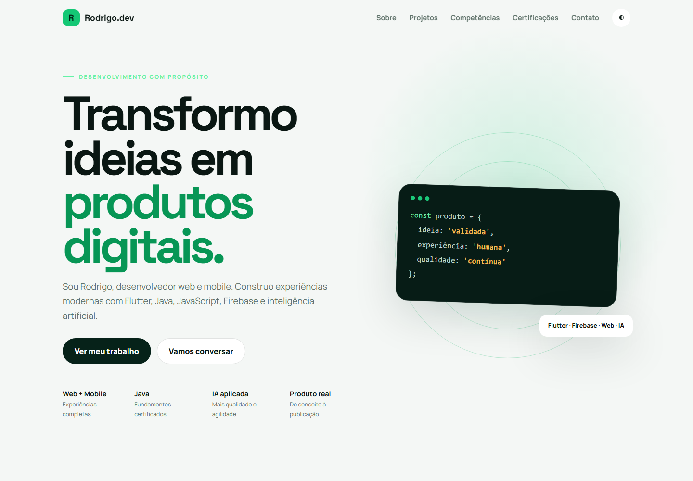

# Portfólio - Rodrigo Marcelo dos Santos

[](https://github.com/Kadys-dv/portfolio-rodrigo/actions/workflows/quality.yml)
[](https://github.com/Kadys-dv/portfolio-rodrigo/actions/workflows/pages.yml)
[](https://kadys-dv.github.io/portfolio-rodrigo/)
[](#stack)

Portfólio profissional para apresentar a trajetória, os projetos e os materiais de candidatura de Rodrigo Marcelo dos Santos, Desenvolvedor de Software Júnior com foco em web, mobile e backend.



## Links rápidos

- Portfólio: <https://kadys-dv.github.io/portfolio-rodrigo/>
- Currículo: <https://kadys-dv.github.io/portfolio-rodrigo/curriculo.html>
- Carta de apresentação: <https://kadys-dv.github.io/portfolio-rodrigo/carta-apresentacao.html>
- LinkedIn: <https://www.linkedin.com/in/rodrigo-marcelo-dos-santos-2851a4429/>

## Objetivo

Um perfil júnior precisa mostrar mais do que tecnologias listadas. Este portfólio prova capacidade prática com projetos reais, estudos de caso, demonstrações, documentos profissionais, SEO e validações automatizadas.

## Solução

O site organiza a apresentação em uma experiência responsiva com:

- Home profissional com proposta de valor, trajetória e contatos.
- Estudos de caso de PlayMatch, MatchHub API, MatchHub Dashboard, Helpdesk e RitmoraX.
- Vídeo real do PlayMatch gravado em aparelho Android.
- Currículo, carta de apresentação e certificados verificáveis.
- SEO com canonical, Open Graph, Twitter Card, sitemap, robots e dados estruturados.
- Testes automatizados para conteúdo, links, layout, comportamento mobile e fluxos essenciais.

## Projetos em destaque

| Projeto | Stack | O que demonstra | Link |
| --- | --- | --- | --- |
| **PlayMatch** | Flutter, Dart, Firebase, Google Maps | Produto mobile com autenticação, mapas, partidas, atletas, chat, avaliações, denúncias e notificações. | [Estudo de caso](https://kadys-dv.github.io/portfolio-rodrigo/projetos/playmatch.html) |
| **MatchHub API** | Java 21, Spring Boot, PostgreSQL, JWT, Docker | Backend REST transacional com segurança, regras de negócio, migrations e testes de integração. | [Estudo de caso](https://kadys-dv.github.io/portfolio-rodrigo/projetos/matchhub-api.html) |
| **MatchHub Dashboard** | Next.js, React, TypeScript, Tailwind CSS | Painel administrativo com BFF, cookie HTTP-only, indicadores, moderação e build de produção. | [Estudo de caso](https://kadys-dv.github.io/portfolio-rodrigo/projetos/matchhub-dashboard.html) |

## Stack

- HTML semântico, CSS modular e JavaScript ES Modules.
- Playwright para validações de navegador e layout.
- Node Test Runner para testes automatizados.
- Biome para lint e formatação.
- Knip para detecção de arquivos e exports não utilizados.
- GitHub Actions e GitHub Pages.

## Estrutura

```text
.
├── assets/       # imagens, vídeos, PDFs e materiais do portfólio
├── js/           # módulos JavaScript da experiência
├── projetos/     # estudos de caso individuais
├── styles/       # CSS principal, base e estudos de caso
├── tests/        # testes unitários, layout e E2E
└── tools/        # scripts auxiliares de mídia
```

## Executar localmente

```powershell
npm install
npm run serve
```

Abra <http://127.0.0.1:4173>.

## Qualidade

```powershell
npm run check
npm run test:layout
npm run test:e2e
```

`npm run check` valida sintaxe, lint, dependências/exports não utilizados e testes unitários. Os testes de layout e E2E usam navegador para conferir desktop, mobile, navegação, tema e seções essenciais.

## Segurança e dados locais

A captura do dashboard usa `MATCHHUB_DEMO_EMAIL` e `MATCHHUB_DEMO_PASSWORD` definidos somente no ambiente local; nenhuma credencial é versionada.

Desenvolvido por Dev Rodrigo. Todos os direitos reservados.
